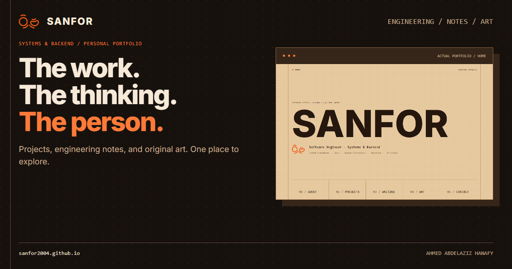

# Sanfor social campaign

Complete framework test for the current portfolio at `sanfor2004.github.io`. Prepared from revision `601715a` and the current workspace on 9 September 2026.

## Start here

- [All finished copy](posts.md): 12 deliverable IDs covering LinkedIn, X, Reddit, Hacker News, DEV, Facebook, Instagram, and follow-up variants. Includes a four-post thread, a complete companion article, and six-slide carousel copy.
- [Visual gallery](index.html): three preview formats and six carousel slides.
- [Project brief and evidence](project-brief.md): identity, audience, story, inspected sources, and platform considerations.
- [Seven-day plan](launch-plan.md): suggested sequence tied to actual copy IDs.
- [Asset descriptions and alt text](assets.md): image provenance, dimensions, and reproduction instructions.
- [Validation](validation.md): copy, link, export, and visual checks.
- [Editable renderer](source/render.mjs) and [verification script](source/verify.mjs).

The campaign describes the portfolio: projects, engineering explanations, and the author. 360Vision appears as one portfolio example. No external posts have been published or scheduled.

Final assets and reproduction files are all inside `Markting/`, which is now the framework's default output folder. Platform-specific community eligibility remains a manual publishing choice; the HN package deliberately uses regular-submission alternatives.
